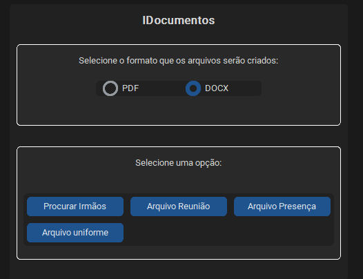

<p align="center">
    
</p>
<p align="center"><h1 align="center">IDOCUMENTOS</h1></p>
<p align="center">
	<em><code>Gerador automatizado de documentos para secretaria escolar</code></em>
</p>
<p align="center">
	
	
	
</p>

---

## 🔗 Sumário

- [📍 Visão Geral](#-visão-geral)
- [👾 Funcionalidades](#-funcionalidades)
- [📁 Estrutura do Projeto](#-estrutura-do-projeto)
- [🚀 Como Começar](#-como-começar)
  - [☑️ Pré-requisitos](#-pré-requisitos)
  - [⚙️ Instalação](#️-instalação)
  - [🤖 Uso](#-uso)
- [📌 Roadmap](#-roadmap)

---

## 📍 Visão Geral

**IDocumentos** é uma aplicação para automação de criação de documentos em massa voltada para instituições de ensino. Permite processar informações de alunos, turmas e responsáveis a partir de planilhas Excel, gerando arquivos personalizados como atas, listas de presença e documentos PDF/DOCX.

---

## 👾 Funcionalidades

- Geração automática de documentos em formato **DOCX** e **PDF**.
- Identificação de irmãos entre os alunos para relatórios específicos.
- Criação de listas de presença por turma e mês.
- Processamento de documentos para reuniões escolares e uniforme escolar.
- Interface gráfica baseada em **CustomTkinter** para facilitar o uso.

---

## 📁 Estrutura do Projeto

```sh
IDocumentos/
├── Alunos-Modelo.xlsx
├── Manuais/
│   ├── Manual_IDocumentos.pdf
│   └── Manual_PlanilhaAlunos.pdf
└── Sistema/
    ├── dist/
    ├── iDocumentosv003.py
    └── templates/
```

### 📂 Descrição dos Componentes

- **Sistema/**: Contém o script principal e os modelos de documentos.
- **Manuais/**: Documentação de apoio para uso do sistema.
- **Templates/**: Modelos de documentos Word usados na personalização.

---

## 🚀 Como Começar

### ☑️ Pré-requisitos

Certifique-se de ter o seguinte ambiente configurado:

- Python 3.x
- Microsoft Word (necessário para conversão para PDF)

### ⚙️ Instalação

1. Clone o repositório:

   ```bash
   git clone https://github.com/juliodf24/IDocumentos.git
   cd IDocumentos
   ```


### 🤖 Uso

1. Você pode executar o aplicativo diretamente pelo executável:

   - Acesse a pasta `Sistema/dist` no diretório do projeto.
   - Localize o arquivo executável gerado (exemplo: `iDocumentos.exe`) e execute-o.

3. Siga as instruções exibidas na interface gráfica para selecionar arquivos, formatos e opções de processamento.

---

## 📌 Roadmap

- [X] Interface gráfica funcional.
- [X] Suporte a arquivos DOCX e PDF.
---

